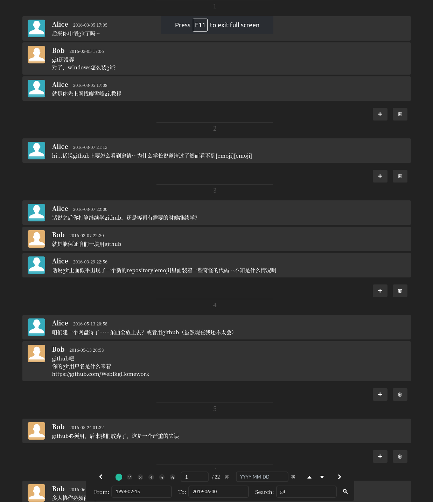

# vim-wechat-explorer

一个简单的微信聊天记录浏览器。支持日期查找、正则查找、对话收藏。

适用于iTools从iOS版微信中导出的文本记录。

测试环境：Ubuntu 18.04 /  Python 3.6+。



## 使用方法

1. [使用iTools从iOS导出文本聊天记录](https://www.zhihu.com/question/20776328/answer/716902617)。
2. 使用此工具进行浏览：

``` bash
# 环境配置
sudo apt install mongodb
sudo service mongodb start
pip3 install --local flask pymongo

# 数据库建立
python3 tools/build_db.py -i /path/to/txt/file/exported/from/iTools

# 启动Flask服务器，然后从浏览器打开 http://127.0.0.1:5000/
python3 app.py
```

## 基本功能

- 将间隔不超过3分钟的聊天记录合并为一条
- 将间隔超过30分钟的聊天记录分割成段
- 双击聊天记录，跳转进入其上下文
- 热键绑定：
  - `h / j / k / l`：上一页 / 向下滚动 / 向上滚动 / 下一页
  - `b / f`：上一段 / 下一段
  - `leftarrow / rightarrow`：上一url / 下一url
  - `/`：输入搜索关键字（支持正则表达式）
  - `:` 输入目标日期
  - `esc`：取消聚焦或隐藏控制面板
  - `n`：进入收藏夹
  - `0`：退出收藏夹
  - `a`：添加当前段到收藏夹（或单击该段末尾的“+”按钮）
  - `d`：将当前段从收藏夹删除（或单击该段末尾的“回收站”按钮）

## 配置选项

```bash
usage: app.py [-h] [--my-name MYNAME] [--your-name YOURNAME]
              [--my-profile MYPROFILE] [--your-profile YOURPROFILE]
              [--start-date STARTDATE] [--end-date ENDDATE] [--hide-control]
              [--font {serif,sans}] [--font-weight FONTWEIGHT]
              [--visible-ip VISIBLE_IP [VISIBLE_IP ...]]

optional arguments:
  # 查看帮助
  -h, --help            show this help message and exit
  # 自己的显示名称
  --my-name MYNAME
  # 对方的显示名称
  --your-name YOURNAME
  # 自己的头像文件名，必须被放置于static/img目录下
  --my-profile MYPROFILE
                        filename of customized profile. must be under
                        static/img/.
  # 对方的头像文件名，必须被放置于static/img目录下
  --your-profile YOURPROFILE
                        filename of customized profile. must be under
                        static/img/.
  # 起始日期：YYYY-MM-DD格式
  --start-date STARTDATE
  # 终止日期：YYYY-MM-DD格式
  --end-date ENDDATE
  # 默认隐藏控制面板
  --hide-control        set to hide control panel on default.
  # 字体设置（也可以通过在static/css/customize.css中调整字体来修改）
  --font {serif,sans}
  # 字体粗细
  --font-weight FONTWEIGHT
  # 可访问IP，默认仅包括127.0.0.1
  # 可在Ubuntu使用ifconfig -a或Windows上使用ipconfig查看本机ip
  --visible-ip VISIBLE_IP [VISIBLE_IP ...]
                        Only visible from this IP address
```

## TODO

- 对搜索框进行sql转义
- 文本选择、复制、粘贴
- url识别
